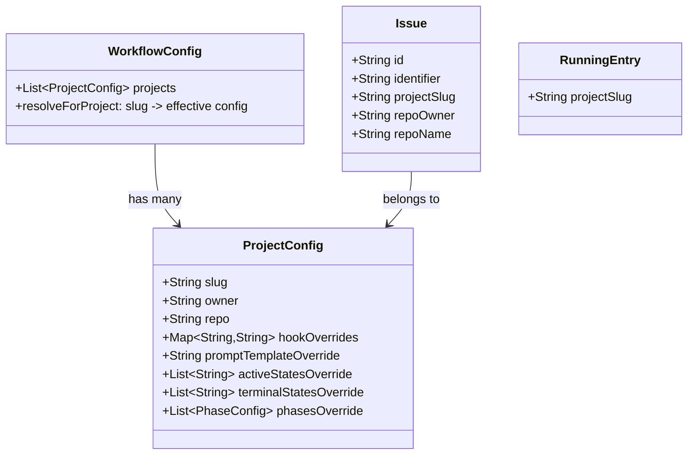
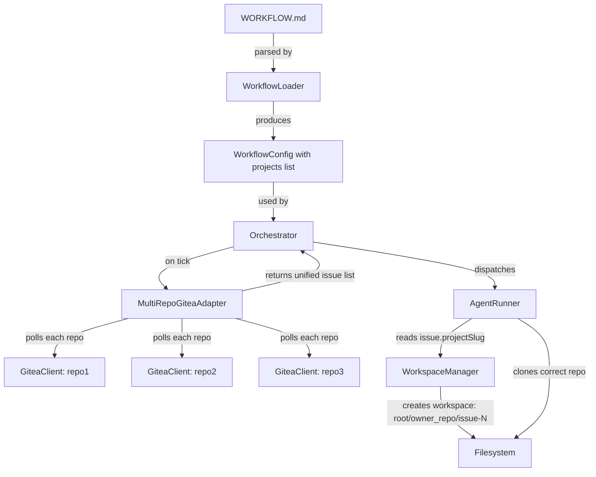

# Multi-Repository Support Plan

## Goal

Enable a single RockOpera instance to poll and work on issues from **multiple Gitea repositories** simultaneously, with shared base configuration and per-repo overrides.

## Current Architecture — Single-Repo Coupling Points

The current system is tightly coupled to a single `owner/repo` in several places:

| Component | Coupling | File |
|-----------|----------|------|
| `WorkflowConfig.trackerProjectSlug` | Single `owner/repo` string | `WorkflowDefinition.kt:29` |
| `GiteaAdapter` | Extracts `owner`/`repo` from single slug in `init` | `GiteaAdapter.kt:36-43` |
| `AgentRunner` | Extracts `owner`/`repo` from single slug in `init` | `AgentRunner.kt:39-44` |
| `AgentRunner.gitClone()` | Builds clone URL from single `owner/repo` | `AgentRunner.kt:356-371` |
| `Issue.identifier` | Format `#number` — no repo prefix | `GiteaAdapter.kt:138` |
| `Issue.id` | Just the issue number — not globally unique across repos | `GiteaAdapter.kt:132` |
| `WorkspaceManager` | Namespaces by issue identifier only | `WorkspaceManager.kt:20-21` |
| `Orchestrator.validateDispatchConfig` | Validates single `trackerProjectSlug` | `Orchestrator.kt:533-534` |
| `Application.kt` | Creates single `GiteaClient` + single `GiteaAdapter` | `Application.kt:62-77` |

## Proposed Design

### WORKFLOW.md Config Changes

Replace single `project_slug` with a `projects` list. Each project can override base settings:

```yaml
tracker:
  kind: gitea
  endpoint: $GITEA_URL
  api_key: $GITEA_TOKEN
  assignee: $TRACKER_ASSIGNEE
  active_states: [open, todo, in-progress, review]
  terminal_states: [done, closed]
  projects:
    - slug: org/frontend-app
    - slug: org/backend-api
      hooks:
        after_create: "npm install"
      prompt_template: |
        You are working on the backend API...
    - slug: org/infra
      active_states: [open, todo]  # override: no review phase for infra
```

**Backward compatibility**: If `project_slug` is set and `projects` is absent, treat it as a single-project list.

### Data Model Changes



### Issue ID Uniqueness

Currently `Issue.id` = Gitea issue number, which is only unique within a repo. With multi-repo:

- **`Issue.id`** becomes `owner/repo#number` — globally unique composite key
- **`Issue.identifier`** becomes `owner/repo#number` — human-readable, also globally unique
- All maps keyed by `issueId` in `OrchestratorState` remain correct

### Component Changes



### Detailed Changes Per File

#### 1. `WorkflowDefinition.kt` — Add `ProjectConfig`

```kotlin
data class ProjectConfig(
    val slug: String,
    val owner: String,  // derived from slug
    val repo: String,   // derived from slug
    val hookAfterCreate: String? = null,
    val hookBeforeRun: String? = null,
    val hookAfterRun: String? = null,
    val hookBeforeRemove: String? = null,
    val promptTemplate: String? = null,
    val activeStates: List<String>? = null,
    val terminalStates: List<String>? = null,
    val phases: List<PhaseConfig>? = null
)
```

Add to `WorkflowConfig`:
```kotlin
val projects: List<ProjectConfig> = emptyList()
```

Add helper:
```kotlin
fun effectiveConfigForProject(slug: String): WorkflowConfig
```

#### 2. `Issue.kt` — Add repo context

```kotlin
data class Issue(
    // ... existing fields ...
    val projectSlug: String = "",  // "owner/repo"
    val repoOwner: String = "",
    val repoName: String = ""
)
```

#### 3. `GiteaAdapter.kt` — Poll multiple repos

- Accept `List<ProjectConfig>` instead of single `owner/repo`
- `fetchCandidateIssues()` iterates over all projects, calls `client.listIssues(owner, repo)` for each
- Each issue gets tagged with `projectSlug`, `repoOwner`, `repoName`
- Issue ID format changes to `owner/repo#number`
- Issue identifier changes to `owner/repo#number`

#### 4. `AgentRunner.kt` — Use issue's repo context

- Remove `owner`/`repo` from `init` block
- Read `owner`/`repo` from `issue.repoOwner`/`issue.repoName`
- `gitClone()` uses issue-specific repo URL
- All Gitea API calls use issue-specific `owner/repo`
- Resolve effective config per project for hooks/prompts

#### 5. `WorkspaceManager.kt` — Namespace by repo

- `createOrReuse(issueIdentifier)` already sanitizes the key
- With new identifier format `owner/repo#number`, the sanitized key becomes `owner_repo_number`
- This naturally namespaces workspaces by repo — no structural change needed

#### 6. `Orchestrator.kt` — Minor changes

- `validateDispatchConfig()`: check that `projects` list is non-empty instead of single `trackerProjectSlug`
- `shouldDispatch()`: no changes needed — works on `Issue` objects regardless of repo
- `dispatchIssue()`: pass effective config for the issue's project to `AgentRunner`

#### 7. `Application.kt` — Wire up multi-repo

- `trackerProvider` creates `GiteaAdapter` with full projects list
- `agentRunnerProvider` receives effective config per project

#### 8. `OrchestratorMessage.kt` — Add repo to snapshots

- `RunningSnapshot` and `RetrySnapshot` get `projectSlug` field

#### 9. `Presenter.kt` — Include repo in JSON

- Add `project_slug` to running/retry JSON output

#### 10. Frontend — Display repo info

- `api.ts`: add `project_slug` to `RunningSession` and `RetryEntry`
- `RunningSessionsTable.tsx`: show repo badge/prefix before issue identifier

### Backward Compatibility

The system must remain backward-compatible with existing single-repo configs:

```kotlin
// In WorkflowLoader.buildConfig():
val projects = if (projectsList.isNotEmpty()) {
    projectsList
} else if (!trackerProjectSlug.isNullOrBlank()) {
    // Legacy single-repo mode
    listOf(ProjectConfig(slug = trackerProjectSlug, ...))
} else {
    emptyList()
}
```

### Edge Cases

1. **Same issue number in different repos**: Handled by composite ID `owner/repo#number`
2. **Per-repo concurrency limits**: Could be added later via `ProjectConfig.maxConcurrentAgents`
3. **Mixed tracker types**: Out of scope — all projects must be on the same Gitea instance
4. **Workspace isolation**: Each repo gets its own workspace directory subtree

## Implementation Order

The changes should be implemented in dependency order:

1. **Data models first**: `ProjectConfig`, `Issue` fields, snapshot types
2. **Config parsing**: `WorkflowLoader` to parse `projects` list
3. **Tracker layer**: `GiteaAdapter` multi-repo polling
4. **Agent layer**: `AgentRunner` per-issue repo resolution
5. **Orchestrator**: validation and dispatch adjustments
6. **Application wiring**: `Application.kt` changes
7. **API/Frontend**: display changes
8. **Tests**: update existing + add multi-repo scenarios
9. **Documentation**: WORKFLOW.md example, README updates
